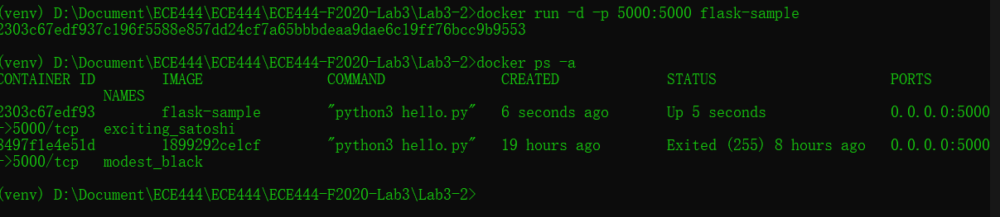
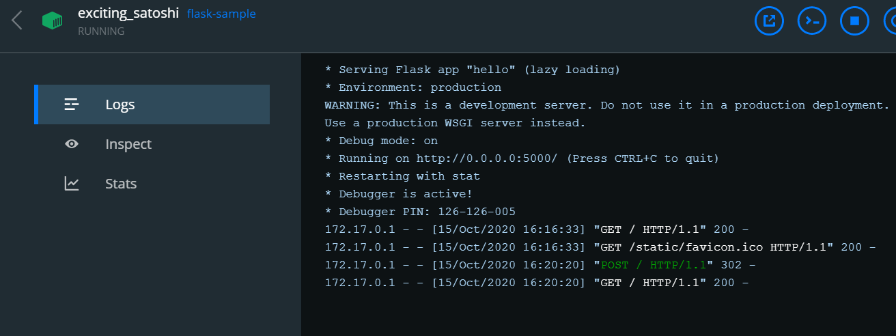
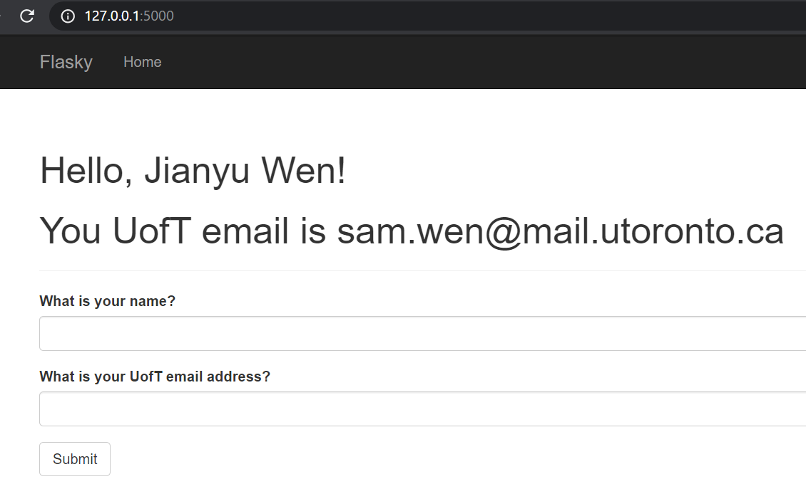

# ECE444-F2020-Lab4&5
ECE444-F2020-Lab4&5\
this repo is a clone of
https://github.com/miguelgrinberg/flasky

Build:
Run `docker build -t flask-sample:latest .` in terminal.

Run:
Run `docker run -d -p 5000:5000 flask-sample` in terminal.

Dockerfile, requirement.txt is in Lab4\.

# Activity 2

# Activity 3
A Docker container image only needs to load what is required for a specific program. It is standalone, and lightweight.

A Virtual Machine, on the other hand, hold everything that runs an operating system. Multiple docker images can be run inside of one virtual machine.

Virtual Machines takes a long time to load, and is much heavier than a typical docker image, while a docker container image is very portable and versatile compared to using virtual machines for developing a small project.
