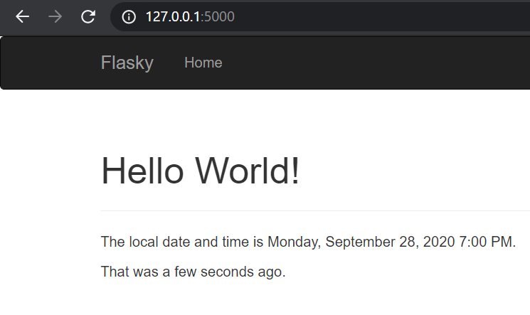

# ECE444-F2020-Lab3
ECE444-F2020-Lab3\
this repo is a clone of
https://github.com/miguelgrinberg/flasky

# Activity 1

# Activity 2

# Activity 3

SQL databases follows a relational model, and can store structured data more efficiently.
NoSQL databases does not follow the relational model, and could have a edge in performance.
